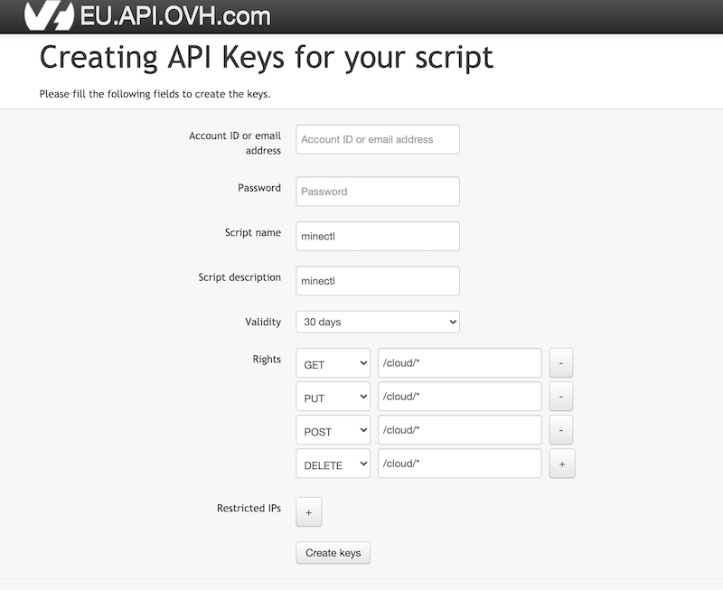

+ [Supported cloud provider ☁](#supported-cloud-provider-)
+ [TL;DR 🚀](#tldr-)
+ [Usage ⚙](#usage-)
    - [Access Token 🔑](#access-token-)
        * [Civo](#civo)
        * [Digital Ocean](#digital-ocean)
        * [Scaleway](#scaleway)
        * [Hetzner](#hetzner)
        * [Linode](#linode)
        * [OVHCloud](#ovhcloud)
        * [Equinix Metal](#equinix-metal)
        * [Google Compute Engine (GCE)](#google-compute-engine-gce)
        * [Vultr](#vultr)
    - [Minecraft Server Versions 📚](#minecraft-server-versions-)
    - [Minecraft Proxy Versions 📚](#minecraft-proxy-versions-)
    - [Server Configs 📋](#server-configs-)
        * [MinecraftProxy Config 📡](#minecraftproxy-config-)
        * [MinecraftServer Config 🕹](#mincraftserver-config-)
    - [EULA ⚖️️](#eula-)
    - [Create Minecraft Server 🏗](#create-minecraft-server-)
    - [Delete Minecraft Server 🗑](#delete-minecraft-server-)
    - [List Minecraft Server 📒](#list-minecraft-server-)
    - [Update Minecraft Server 🆙](#update-minecraft-server-)
    - [Plugins Minecraft Server ⤴️](#plugins-minecraft-server-)
    - [RCON Minecraft Server 🔌](#rcon-minecraft-server-)
    - [Monitoring 📊](#monitoring-)
    - [Volumes 💽](#volumes-)
    - [Getting Started 🎫](#getting-started-)
+ [Known Limitation 😵](#known-limitation-)
+ [Contributing 🤝](#contributing-)
    - [Contributing via GitHub](#contributing-via-github)
    - [License](#license)
+ [Roadmap 🛣️](#roadmap-)
+ [Libraries & Tools 🔥](#libraries--tools-)
+ [Legal Disclaimer 👮](#legal-disclaimer-)

# minectl 🗺


`minectl`️️ is a cli for creating Minecraft (java or bedrock) server on different cloud provider.

It is a private side project of me, to learn more about Go, CLI and multi cloud.

### Supported cloud provider ☁

+ Civo (https://www.civo.com/)
+ Scaleway (https://www.scaleway.com)
+ DigitalOcean (https://www.digitalocean.com/)
+ Hetzner (https://www.hetzner.com/)
+ Linode (https://www.linode.com/)
+ OVHCloud (https://www.ovh.com/)
+ Equinix Metal (https://metal.equinix.com/)
+ Google Compute Engine (GCE) (https://cloud.google.com/compute)

### TL;DR 🚀

Install via homebrew:

```bash
brew tap dirien/homebrew-dirien
brew install minectl
```

Linux or Windows user, can directly download (or use `curl`/`wget`) the binary via
the [release page](https://github.com/dirien/minectl/releases).

### Usage ⚙

#### Access Token 🔑

`minectl` is completely build on zero-trust. It does not save any API Tokens, instead it looks them up in the ENV
variables.

##### Civo

```bash
export CIVO_TOKEN=xx
```

##### Digital Ocean

```bash
export DIGITALOCEAN_TOKEN=xxx
```

##### Scaleway

```bash
export ACCESS_KEY=xxx
export SECRET_KEY=yyy
export ORGANISATION_ID=zzz
```

##### Hetzner

```bash
export HCLOUD_TOKEN=yyyy
```

##### Linode

```bash
export LINODE_TOKEN=xxxx
```

#### OVHCloud

You need to create API keys per endpoint. For an overview of available endpoint
check [supported-apis](https://github.com/ovh/go-ovh#supported-apis) documentation

For, example, Europe visit https://eu.api.ovh.com/createToken to create your API keys for minectl 🗺



For the proper `rights` choose all HTTP Verbs (GET,PUT,DELETE, POST), and we need only the `/cloud/` API.

```bash
export OVH_ENDPOINT=ovh-eu
export APPLICATION_KEY=xxx
export APPLICATION_SECRET=yyy
export CONSUMER_KEY=zzz
export SERVICENAME=<projectid>
```

#### Equinix Metal

```bash
export PACKET_AUTH_TOKEN=xxx
export EQUINIX_PROJECT=yyy
```

#### Google Compute Engine (GCE)

```bash
export GCE_KEY=<pathto>/key.json
```

#### Vultr

```bash
export VULTR_API_KEY=xxx
```

See [Getting Started - GCE edition](docs/getting-started-gce.md) for details on how to create a GCP service account for
minectl 🗺

#### Minecraft Server Versions 📚

> ⚠️ `minectl 🗺` is not(!) providing any pre-compiled binaries of Minecraft or download a pre-compiled version.
>
> Every _non-vanilla_ version will be compiled during the build phase of your server.

Following Minecraft versions is `minectl 🗺` supporting.

##### Vanilla (Mincraft: Java Edition or Bedrock Edition)

The Vanilla software is the original, untouched, unmodified Minecraft server software created and distributed directly
by Mojang.

##### CraftBukkit

CraftBukkit is lightly modified version of the Vanilla software allowing it to be able to run Bukkit plugins.

##### Spigot

Spigot is the most popular used Minecraft server software in the world. Spigot is a modified version of CraftBukkit with
hundreds of improvements and optimizations that can only make CraftBukkit shrink in shame.

##### PaperMC

Paper (formerly known as PaperSpigot, distributed via the Paperclip patch utility) is a high performance fork* of
Spigot.

##### Forge

Forge is well known for being able to use Forge Mods which are direct modifications to the Minecraft program code. In
doing so, Forge Mods can change the gaming-feel drastically as a result of this.

##### Fabric

Fabric is also an mod loader like Forge is with some improvements. Its lightweight and faster and it may is being the
best mod loader in the future because its doing very good.

Source: [[1]](#1-httpswwwspigotmcorgwikiwhat-is-spigot-craftbukkit-bukkit-vanilla-forg)

#### Minecraft Proxy Versions 📚

Network proxy server is what you set up and use as the controller of a network of server - this is the server that
connects all of your playable servers together so people can log in through one server IP, and then teleport between the
separate servers ingame rather than having to log out and into each different one.

A server network typically consist of the following servers:

1. The proxy server itself running the desired software (BungeeCord being the most widely used and supported). This is
   the server that you would be advertising the IP of, as all players should be logging in through the proxy server at
   all times

2. The hub (or main) server. When users connect to the network proxy server's IP, it will re-route those users to this
   server.

3. All additional servers beyond the main server. Once you have at least one server running the proxy and one as the
   hub, any other servers will be considered extra servers that you can teleport to from the hub.

##### Bungee Cord

BungeeCord is a useful software written in-house by the team at SpigotMC. It acts as a proxy between the player's client
and the connected Minecraft servers. End-users of BungeeCord see no difference between it and a normal Minecraft server.

##### Waterfall

Waterfall is a fork of BungeeCord, a proxy used primarily to teleport players between multiple Minecraft servers.

Waterfall focuses on three main areas:

- Stability
- Features
- Scalability

#### Server Configs 📋

##### MinecraftProxy Config 📡

If you want to start a server with a Minecraft Proxy, you need to define a MinecraftProxy proxy.

```yaml
apiVersion: ediri.io/minectl/v1alpha1
kind: MinecraftProxy
metadata:
  name: minecraft-proxy
spec:
  server:
    cloud: <cloud provider name civo|scaleway|do|hetzner|linode|ovh|equinix|gce|vultr>
    region: <cloud provider region>
    size: <cloud provider plan>
    ssh: "/Users/dirien/Tools/repos/stackit-minecraft/minecraft/ssh/minecraft"
    port: <server port>
  proxy:
    java:
      openjdk: <jdk version>
      xmx: <xmx memory for the vm>
      xms: <xms memory for the vm>
      rcon:
        password: <RCON server password>
        port: <RCON server port >
        enabled: <RCON enabled true|false>
        broadcast: <RCON broadcase true|false
    type: "bungeecord|waterfall"
    version: <version>
```

##### MincraftServer Config 🕹

You need a MinecraftServer manifest file, to describe the underlying compute instance and the Minecraft Server:

```yaml
apiVersion: ediri.io/minectl/v1alpha1
kind: MinecraftServer
metadata:
  name: minecraft-server
spec:
  monitoring:
    enabled: true|false
  server:
    cloud: "provider: civo|scaleway|do|hetzner|linode|ovh|equinix|gce|vultr"
    region: "region see cloud provider for details eg. fra1"
    size: "see cloud provider docs for details eg. g3.large"
    volumeSize: 100
    ssh: "<path to ssh public and private key>/ssh"
    port: "25565|19132 are the defaults for tcp/udp"
  minecraft:
    java:
      openjdk: "8|16 use jdk 8 for <1.17 java server version"
      xmx: 2G
      xms: 2G
      rcon:
        password: test
        port: 25575
        enabled: true
        broadcast: true
    edition: "java|bedrock|craftbukkit|fabric|forge|papermc|spigot"
    version: "<version>"
    eula: true
    properties: |
      level-seed=stackitminecraftrocks
      broadcast-rcon-to-ops=true
      ...
```

I created some example configs in the [config](config) folder for currently supported cloud provider and Minecraft
editions.

#### EULA ⚖

You need to set explicitly the EULA as new property in the MinecraftServer manifest to indicate your agreement with the
Minecraft End User License. See -> https://minecraft.net/terms for the details.

#### Create Minecraft Server 🏗

```bash
minectl create -h

Create an Minecraft Server.

Usage:
  minectl create [flags]

Examples:
mincetl create  \
    --filename server-do.yaml

Flags:
  -f, --filename string   Contains the configuration for minectl
  -h, --help              help for create
  -w, --wait              Wait for Minecraft Server is started (default true)  
```

#### Delete Minecraft Server 🗑

```bash
minectl delete -h

Delete an Minecraft Server.

Usage:
  minectl delete [flags]

Examples:
mincetl delete  \
    --filename server-do.yaml
    --id xxx-xxx-xxx-xxx
        

Flags:
  -f, --filename string   that contains the configuration for minectl
  -h, --help              help for delete
      --id string         contains the server id
```

#### List Minecraft Server 📒

```bash
minectl list -h

List all Minecraft Server.

Usage:
  minectl list [flags]

Examples:
mincetl list  \
    --provider civo \
    --region LON1

Flags:
  -h, --help              help for list
  -p, --provider string   The cloud provider - civo|scaleway|do|hetzner|linode|ovh|equinix|gce
  -r, --region string     The region for your cloud provider
```

#### Update Minecraft Server 🆙

Update the Minecraft version. The function uses  `ssh` (port 22).

```bash
minectl update -h
Update an Minecraft Server.

Usage:
  minectl update [flags]

Examples:
mincetl update  \
    --filename server-do.yaml
    --id xxx-xxx-xxx-xxx

Flags:
  -f, --filename string   Contains the configuration for minectl
  -h, --help              help for update
      --id string         contains the server id
```

#### RCON Minecraft Server 🔌

Use this function, to connect to the RCON port of your Minecraft Server. RCON is a protocol that allows server
administrators to remotely execute Minecraft commands.

```bash
minectl rcon -h
RCON client to your Minecraft server.

Usage:
  minectl rcon [flags]

Examples:
mincetl rcon  \
    --filename server-do.yaml / \
    --id xxxx

Flags:
  -f, --filename string   Contains the configuration for minectl
  -h, --help              help for rcon
      --id string         contains the server id
```

#### Plugins Minecraft Server ⤴️

> 🚧 Plugins feature is still in beta.

Raw mode, to upload a local plugin file to your server. The function uses  `ssh` (port 22).

```bash
minectl plugins  -h
Manage your plugins for a specific server

Usage:
  minectl plugins [flags]

Examples:
mincetl plugins  \
    --filename server-do.yaml
    --id xxx-xxx-xxx-xxx
        --plugin plugin.jar
    --destination /minecraft/mods

Flags:
  -d, --destination string   Plugin destination location
  -f, --filename string      Contains the configuration for minectl
  -h, --help                 help for plugins
      --id string            contains the server id
  -p, --plugin string        Local plugin file location
```

#### Monitoring 📊

Monitoring is optional and disabled by default. It can be enabled with simply adding following fields to the
MinecraftServer manifest:

```yaml
...
apiVersion: ediri.io/minectl/v1alpha1
kind: MinecraftServer
metadata:
  name: minecraft-server
spec:
  monitoring:
    enabled: true|false
  server:
...
```

Every instance of minectl 🗺, has following monitoring components included:

- Prometheus (https://github.com/prometheus/prometheus)
- Node exporter (https://github.com/prometheus/node_exporter)

The `edition:java` has on top following exporter included:

- Minecraft exporter (https://github.com/dirien/minecraft-prometheus-exporter)

You can acces the `prometheus` via

```bash
http://<ip>:9090/graph
```

#### Volumes 💽

With the `volumeSize` property, you can provision an extra volume during the creation phase of the server.

It is always recommended using the provided volume of the server, but in some cases (large mod packs, community server,
etc.) it makes sense to provision a bigger volume separately.

When a separate volume is defined, `minectl` is automatically installing the Minecraft binaries on this volume.

```yaml
apiVersion: ediri.io/minectl/v1alpha1
kind: MinecraftServer
metadata:
  name: minecraft-server
spec:
  server:
    cloud: linode
    region: eu-central
    size: g6-standard-4
    volumeSize: 100
    ssh: "/Users/dirien/Tools/repos/stackit-minecraft/minecraft/ssh/minecraft"
    port: 25565
  minecraft:
...
```

#### Getting Started 🎫

- [Civo Java Edition](docs/getting-started-civo.md)
- [Civo Bedrock Edition](docs/getting-started-civo-bedrock.md)
- [Scaleway Java Edition](docs/getting-started-scaleway.md)
- [How to monitor your multi-cloud minectl 🗺 server?](docs/multi-server-monitoring-civo.md)
- [Running a modded LuckyBlocks Minecraft Server on budget 💰 - Scaleway edition](docs/running-minecraft-luckyblocks-budget-scaleway.md)
- [Running a PaperMC SkyBlock server - Hetzner edition](docs/skyblock-papermc-hetzner.md)

### Known Limitation 😵

`minectl` is still under development. There will be the possibility for breaking changes.

### Contributing 🤝

#### Contributing via GitHub

Feel free to join.

#### License

Apache License, Version 2.0

### Roadmap 🛣

- [x] Support Bedrock edition [#10](https://github.com/dirien/minectl/issues/10)
- [x] Add monitoring capabilities to minectl server [#21](https://github.com/dirien/minectl/issues/21)
- [x] List Minecraft Server [#11](https://github.com/dirien/minectl/issues/11)
- [x] New Command - Update Minecraft Server [#12](https://github.com/dirien/minectl/issues/12)
- [x] New cloud provider - Hetzner [#26](https://github.com/dirien/minectl/issues/26)
- [x] New cloud provider - Linode [#31](https://github.com/dirien/minectl/issues/31)
- [x] New cloud provider - OVHCloud [#43](https://github.com/dirien/minectl/issues/43)
- [x] New Cloud Provider Equinix Metal [#49](https://github.com/dirien/minectl/issues/49)
- [x] New cloud provider - GCE [#55](https://github.com/dirien/minectl/issues/55)
- [x] Add modded versions as new edition [#20](https://github.com/dirien/minectl/issues/20)
- [x] New cloud provider - Vultr [#90](https://github.com/dirien/minectl/issues/90)
- [x] Add Suport for Proxy Server - bungeecord and waterfall [#95](https://github.com/dirien/minectl/issues/95)
- [ ] ...

### Libraries & Tools 🔥

- https://github.com/fatih/color
- https://github.com/melbahja/goph
- https://github.com/spf13/cobra
- https://github.com/goreleaser
- https://github.com/briandowns/spinner
- https://github.com/civo/civogo
- https://github.com/digitalocean/godo
- https://github.com/scaleway/scaleway-sdk-go
- https://github.com/linode/linodego
- https://github.com/hetznercloud/hcloud-go
- https://github.com/olekukonko/tablewriter
- https://github.com/sethvargo/go-password
- https://github.com/ovh/go-ovh
- https://github.com/dirien/ovh-go-sdk
- https://github.com/packethost/packngo
- https://github.com/hashicorp/go-retryablehttp
- https://github.com/melbahja/goph
- https://github.com/googleapis/google-api-go-client
- https://github.com/Masterminds/sprig
- https://github.com/Tnze/go-mc
- https://github.com/c-bata/go-prompt
- https://github.com/vultr/govultr

### Legal Disclaimer 👮

This project is not affiliated with Mojang Studios, XBox Game Studios, Double Eleven or the Minecraft brand.

"Minecraft" is a trademark of Mojang Synergies AB.

Other trademarks referenced herein are property of their respective owners.

Source:

##### [1] https://www.spigotmc.org/wiki/what-is-spigot-craftbukkit-bukkit-vanilla-forg/