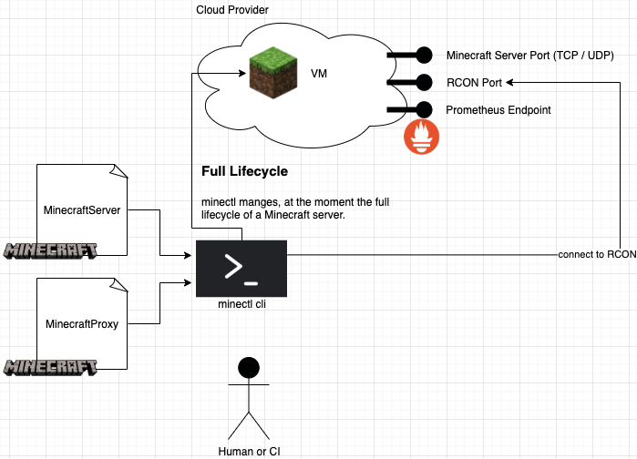

# minectl 🗺 Architecture diagram

The architecture of minectl is quite straight forward:

With the help of different types of cloud provider implementations, we are able to translate a MinecraftSever or
MinecraftProxy manifest into a running VM instance.

Several Ports where exposed in the is process, where the Server or Proxy port is the minimum. If the User wants to
expose a monitoring on top, he can enable this in the manifest files.