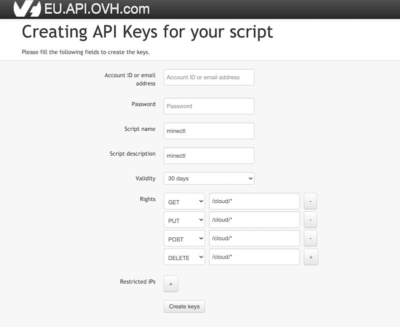

# Authentication

`minectl` is completely built on zero-trust. It does not save any API tokens, instead it looks them up in environment variables.

## Cloud Provider Credentials

### Civo

```bash
export CIVO_TOKEN=xx
```

### DigitalOcean

```bash
export DIGITALOCEAN_TOKEN=xxx
```

### Scaleway

```bash
export ACCESS_KEY=xxx
export SECRET_KEY=yyy
export ORGANISATION_ID=zzz
```

### Hetzner

```bash
export HCLOUD_TOKEN=yyyy
```

### Akamai Connected Cloud

```bash
export LINODE_TOKEN=xxxx
```

### OVHCloud

You need to create API keys per endpoint. For an overview of available endpoints, check the [supported-apis](https://github.com/ovh/go-ovh#supported-apis) documentation.

For example, Europe visit https://eu.api.ovh.com/createToken to create your API keys for `minectl`.



For the proper `rights` choose all HTTP Verbs (GET, PUT, DELETE, POST), and we need only the `/cloud/*` API.

```bash
export OVH_ENDPOINT=ovh-eu
export APPLICATION_KEY=xxx
export APPLICATION_SECRET=yyy
export CONSUMER_KEY=zzz
export SERVICENAME=<projectid>
```

### Google Compute Engine (GCE)

`minectl` uses Google Cloud's Application Default Credentials (ADC) for authentication. This supports multiple authentication methods:

#### Option 1: Sign in with gcloud CLI (Recommended)

```bash
gcloud auth application-default login
export GOOGLE_PROJECT=<your-project-id>
export GOOGLE_SERVICE_ACCOUNT_EMAIL=<your-service-account>@<project>.iam.gserviceaccount.com
```

#### Option 2: Service account JSON file

```bash
export GOOGLE_APPLICATION_CREDENTIALS=<path-to>/service-account.json
export GOOGLE_PROJECT=<your-project-id>
export GOOGLE_SERVICE_ACCOUNT_EMAIL=<your-service-account>@<project>.iam.gserviceaccount.com
```

#### Required Environment Variables

| Variable | Description |
|----------|-------------|
| `GOOGLE_PROJECT` | Your GCP project ID |
| `GOOGLE_SERVICE_ACCOUNT_EMAIL` | Service account email (required for OS Login SSH access) |
| `GOOGLE_APPLICATION_CREDENTIALS` | (Optional) Path to service account JSON file |

See [Getting Started - GCE edition](getting-started-gce.md) for details on how to create a GCP service account for `minectl`.

### Vultr

```bash
export VULTR_API_KEY=xxx
```

### Azure

> Please select a Hypervisor Generation '2' VM Size. As `minectl` uses only Hypervisor Generation 2 Images.

`minectl` uses Azure's DefaultAzureCredential for authentication, which supports multiple authentication methods automatically.

#### Required Environment Variable

```bash
export AZURE_SUBSCRIPTION_ID=xxx
```

#### Option 1: Sign in with Azure CLI (Recommended)

```bash
az login
export AZURE_SUBSCRIPTION_ID=<your-subscription-id>
```

#### Option 2: Service principal with a secret

```bash
export AZURE_SUBSCRIPTION_ID="<subscription_id>"
export AZURE_TENANT_ID="<active_directory_tenant_id>"
export AZURE_CLIENT_ID="<service_principal_appid>"
export AZURE_CLIENT_SECRET="<service_principal_password>"
```

#### Option 3: Service principal with certificate

```bash
export AZURE_SUBSCRIPTION_ID="<subscription_id>"
export AZURE_TENANT_ID="<active_directory_tenant_id>"
export AZURE_CLIENT_ID="<service_principal_appid>"
export AZURE_CLIENT_CERTIFICATE_PATH="<azure_client_certificate_path>"
```

#### Option 4: Username and password

```bash
export AZURE_SUBSCRIPTION_ID="<subscription_id>"
export AZURE_CLIENT_ID="<service_principal_appid>"
export AZURE_USERNAME="<azure_username>"
export AZURE_PASSWORD="<azure_user_password>"
```

#### Option 5: Managed identity (when running on Azure)

```bash
export AZURE_SUBSCRIPTION_ID="<subscription_id>"
export AZURE_CLIENT_ID="<user_assigned_managed_identity_client_id>"
```

See [Azure authentication with the Azure SDK for Go](https://docs.microsoft.com/en-us/azure/developer/go/azure-sdk-authentication) for details.

### Oracle Cloud Infrastructure

The authentication uses OCI config file with the default profile.

Example:

```bash
cat /Users/user/.oci/config

[DEFAULT]
user=<ocid>
fingerprint=<SSH fingerprint>
key_file=<path to PEM file>
tenancy=<ocid>
region=<region>
```

Please follow the instructions at https://docs.oracle.com/en-us/iaas/Content/API/Concepts/apisigningkey.htm

### Amazon AWS

`minectl` uses the standard AWS credential chain, which supports multiple authentication methods automatically.

#### Option 1: Sign in with AWS CLI (Recommended)

```bash
aws configure
```

This creates credentials in `~/.aws/credentials` and config in `~/.aws/config`.

#### Option 2: Shared credentials file

The credentials file is located in `~/.aws/credentials`:

```bash
cat ~/.aws/credentials
[default]
aws_access_key_id = xxxx
aws_secret_access_key = zzzz
```

#### Option 3: Environment variables

```bash
export AWS_ACCESS_KEY_ID=<aws_access_key_id>
export AWS_SECRET_ACCESS_KEY=<aws_secret_access_key>
export AWS_REGION=<aws_region>
```

#### Option 4: IAM instance profile (when running on EC2)

When running on EC2, credentials are automatically retrieved from the instance metadata service.

#### Credential Chain Order

`minectl` looks for credentials in the following order:
1. Environment variables
2. Shared credentials file (`~/.aws/credentials`)
3. Shared config file (`~/.aws/config`)
4. IAM instance profile (EC2)
5. Container credentials (ECS/Fargate)

### VEXXHOST

It is recommended to store OpenStack credentials as environment variables because it decouples credential information from source code.

Download the `OpenStack RC File` from the Horizon UI by clicking on the "Download OpenStack RC File" button at the top right-hand corner.

To execute the file, run `source xxxx-openrc.sh` and you will be prompted for your password.

### Multipass

> Set the plan to cpu-memG. For example: `1-2G`

Multipass is a mini-cloud on your workstation using native hypervisors of all the supported platforms (Windows, macOS and Linux). It will give you an Ubuntu command line in just a click ("Open shell") or a simple `multipass shell` command, or even a keyboard shortcut.

Find what images are available with `multipass find` and create new instances with `multipass launch`.

To install multipass, follow the instructions on [multipass.run](https://multipass.run/) for your platform.

### Exoscale

Go to the IAM section in the Exoscale Console and create a new API key. You can restrict the key to just perform operations on the `compute` service.

```bash
export EXOSCALE_API_KEY=<key>
export EXOSCALE_API_SECRET=<secret>
```

### Fuga Cloud

To get the `OpenStack RC File` from the Fuga Cloud UI, follow these steps:

1. Log in to the Fuga Cloud Dashboard
2. Go to Account -> Access -> Credentials
3. You can choose a user credential or team credential
4. If you haven't already, you should create one of these credentials. Hold on to the password
5. Click on download OpenRC. This file contains all necessary configurations for the client

```bash
source fuga-openrc.sh
```

Enter the password which matches the username of the contents of the OpenRC file.
