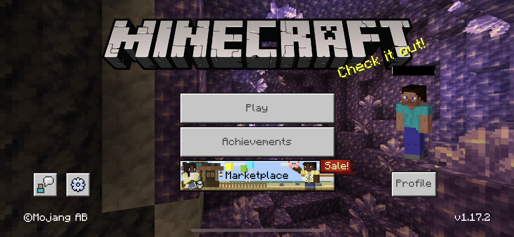
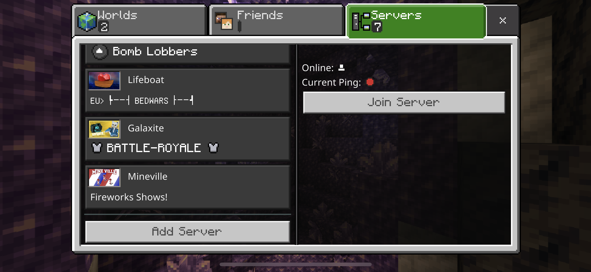
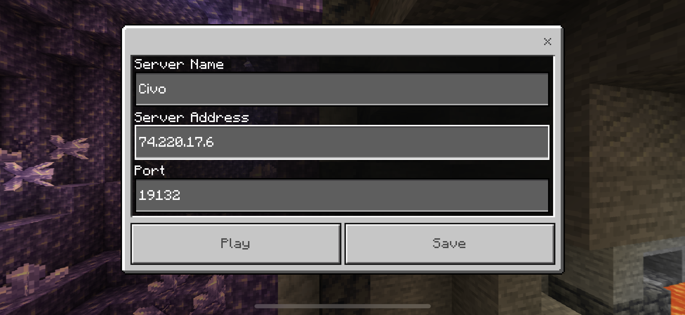
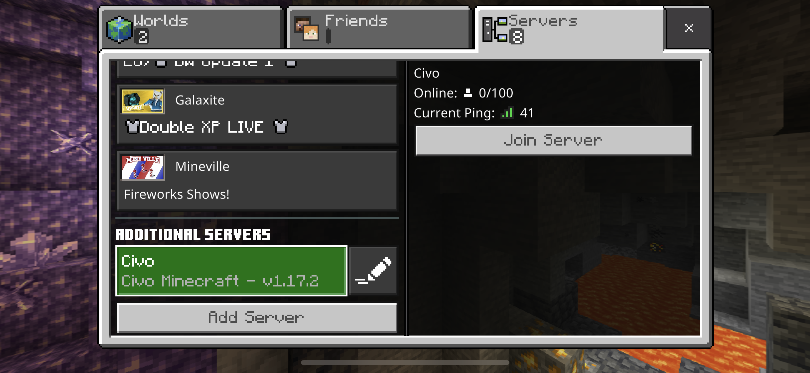
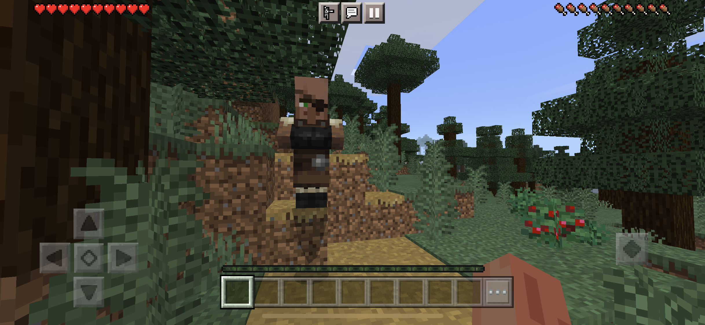

# Getting Started on Civo with the Bedrock edition

Bedrock Edition (also known as the Bedrock editions, Bedrock versions, or just Bedrock) refers to the multi-platform
versions of Minecraft developed by Mojang Studios, Xbox Game Studios, and SkyBox Labs and based on the Bedrock codebase.

To setup a bedrock server, just follow [getting started with Civo](getting-started-civo.md) except of following changes:

###### Attention: The server.properties of the bedrock edition is different to the java edition

## Create MinecraftServer bedrock config

```bash
apiVersion: ediri.io/minectl/v1alpha1
kind: MinecraftServer
metadata:
  name: minecraft-server
spec:
  server:
    cloud: civo
    region: LON1
    size: g3.large
    volumeSize: 100
    ssh: "xxx/ssh/minecraft.pub"
  minecraft:
    edition: bedrock
    properties: |
      server-name=Civo Minecraft
      gamemode=survival
      force-gamemode=false
      difficulty=normal
      allow-cheats=false
      max-players=100
      online-mode=true
      white-list=false
      server-port=19132
      server-portv6=19133
      view-distance=32
      tick-distance=4
      player-idle-timeout=30
      max-threads=8
      level-name=Bedrock level
      level-seed=
      default-player-permission-level=member
      texturepack-required=false
      content-log-file-enabled=false
      compression-threshold=1
      server-authoritative-movement=server-auth
      player-movement-score-threshold=20
      player-movement-distance-threshold=0.3
      player-movement-duration-threshold-in-ms=500
      correct-player-movement=false
      server-authoritative-block-breaking=false
```

## minectl 🗺

```bash
minectl create --filename config/server-civo.yaml 

🛎 Using cloud provider Civo
🗺 Minecraft bedrock edition
🏗 Creating instance (minecraft-server)... ⣟ 
✅ Instance (minecraft-server) created
Minecraft Server IP: 74.220.17.6
Minecraft Server ID: c697ba04-8e22-44d0-b491-74622d637938

To delete the server type:

 minectl delete -f config/bedrock/server-civo.yaml --id c697ba04-8e22-44d0-b491-74622d637938
```

## Minecraft Mobile Client

In this document, I use the iPhone Minecraft Client



Add your server





Join the server



Play the game



## minectl 🗺

Feed up with your bedrock server? Deleting is as easy as creating the server

```bash
minectl delete --filename config/server-civo.yaml --id a7ad735a-d1e9-4951-9f9b-83221efd945e

🛎 Using cloud provider Civo
🗺 Minecraft bedrock edition
🗑 Delete instance (c697ba04-8e22-44d0-b491-74622d637938)...
```

### Legal Disclaimer 👮

This project is not affiliated with Mojang Studios, XBox Game Studios, Double Eleven or the Minecraft brand.

"Minecraft" is a trademark of Mojang Synergies AB.

Apple, the Apple logo, Apple TV, Finder, Final Cut, Final Cut Pro, FireWire, GarageBand, Geneva, Inkwell, iPhone,
iPhoto, iPod, iTunes, iTunes Plus, Logic, Mac, Macintosh, Mac OS, MacBook, Pages, Pixlet, QuickTime, Spotlight, and
TrueType are trademarks of Apple Inc., registered in the U.S. and other countries.

Other trademarks referenced herein are property of their respective owners.

