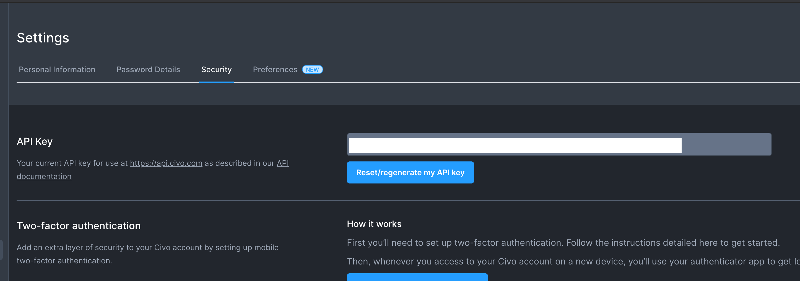
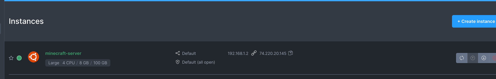
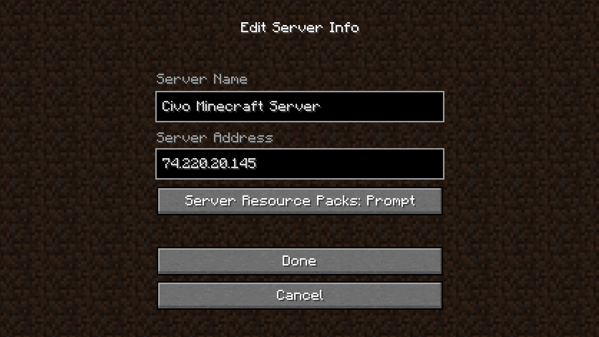
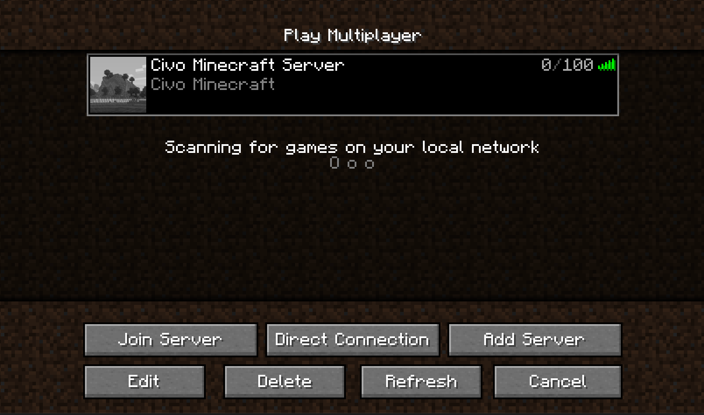
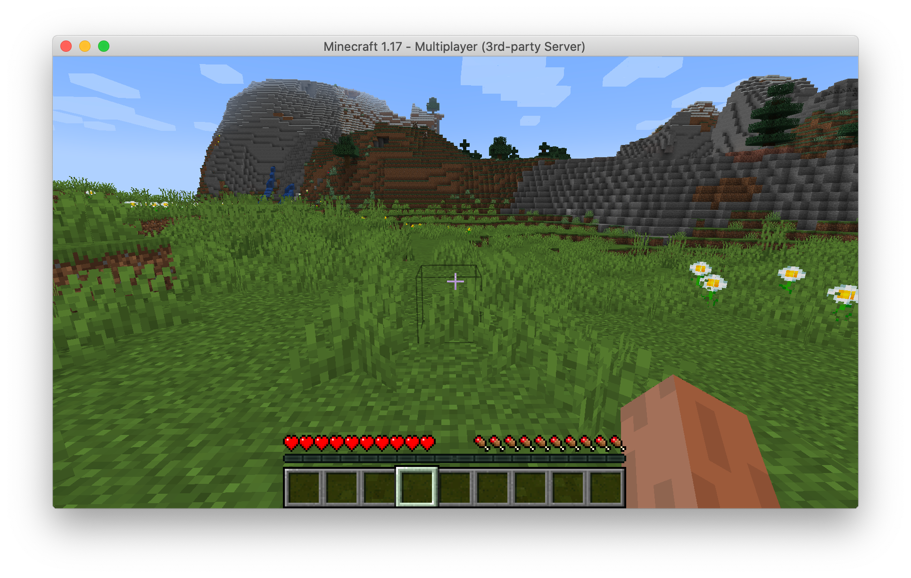

# Getting Started - Civo edition

## API Key

Get your API Key via https://www.civo.com/account/security 



Export the key as ENV variable:

```
export CIVO_TOKEN=xx
```

## Create SSH Keys

```
ssh-keygen -t rsa -f ./minecraft
```

## Create MinecraftServer config

```bash
apiVersion: ediri.io/minectl/v1alpha1
kind: MinecraftServer
metadata:
  name: minecraft-server
spec:
  server:
    cloud: civo
    region: LON1
    size: g3.large
    volumeSize: 100
    ssh: "xxx/ssh/minecraft"
  minecraft:
    java:
      xmx: 2G
      xms: 2G
      rcon:
        password: test
        port: 25575
        enabled: true
        broadcast: true
    edition: java
    version: 1.17.1
    eula: true
    properties: |
      level-seed=randomseed
      view-distance=10
      enable-jmx-monitoring=false
      server-ip=
      resource-pack-prompt=
      gamemode=survival
      server-port=25565
      allow-nether=true
      enable-command-block=false
      sync-chunk-writes=true
      enable-query=false
      op-permission-level=4
      prevent-proxy-connections=false
      resource-pack=
      entity-broadcast-range-percentage=100
      level-name=world
      player-idle-timeout=0
      motd=Civo Minecraft
      query.port=25565
      force-gamemode=false
      rate-limit=0
      hardcore=false
      white-list=false
      broadcast-console-to-ops=true
      pvp=true
      spawn-npcs=true
      spawn-animals=true
      snooper-enabled=true
      difficulty=easy
      function-permission-level=2
      network-compression-threshold=256
      text-filtering-config=
      require-resource-pack=false
      spawn-monsters=true
      max-tick-time=60000
      enforce-whitelist=false
      use-native-transport=true
      max-players=100
      resource-pack-sha1=
      spawn-protection=16
      online-mode=true
      enable-status=true
      allow-flight=false
      max-world-size=29999984
```

## minectl 🗺

```bash
minectl create --filename config/java/server-civo.yaml 

🛎 Using cloud provider Civo
🗺 Minecraft java edition
🏗 Creating instance (minecraft-server)... ⣷ 
✅ Instance (minecraft-server) created
Minecraft Server IP: 74.220.17.7
Minecraft Server ID: 7b9ed37c-fb35-49de-a996-a5f8ae7b7fc1

To delete the server type:

 minectl delete -f config/java/server-civo.yaml --id 7b9ed37c-fb35-49de-a996-a5f8ae7b7fc1
```



## Minecraft Client

### Download
Download a Minecraft Client (Java Edition) under https://www.minecraft.net/en-us/get-minecraft

Start your Minecraft Client


Add your server



Join the server



Play the game



## minectl 🗺 

Feed up with your server? Deleting is as easy as creating the server

```bash
minectl delete --filename config/java/server-civo.yaml --id a7ad735a-d1e9-4951-9f9b-83221efd945e

🛎 Using cloud provider Civo
🗺 Minecraft java edition
🗑 Delete instance (7b9ed37c-fb35-49de-a996-a5f8ae7b7fc1)... 
```

### Legal Disclaimer 👮

This project is not affiliated with Mojang Studios, XBox Game Studios, Double Eleven or the Minecraft brand.

"Minecraft" is a trademark of Mojang Synergies AB.

Other trademarks referenced herein are property of their respective owners.