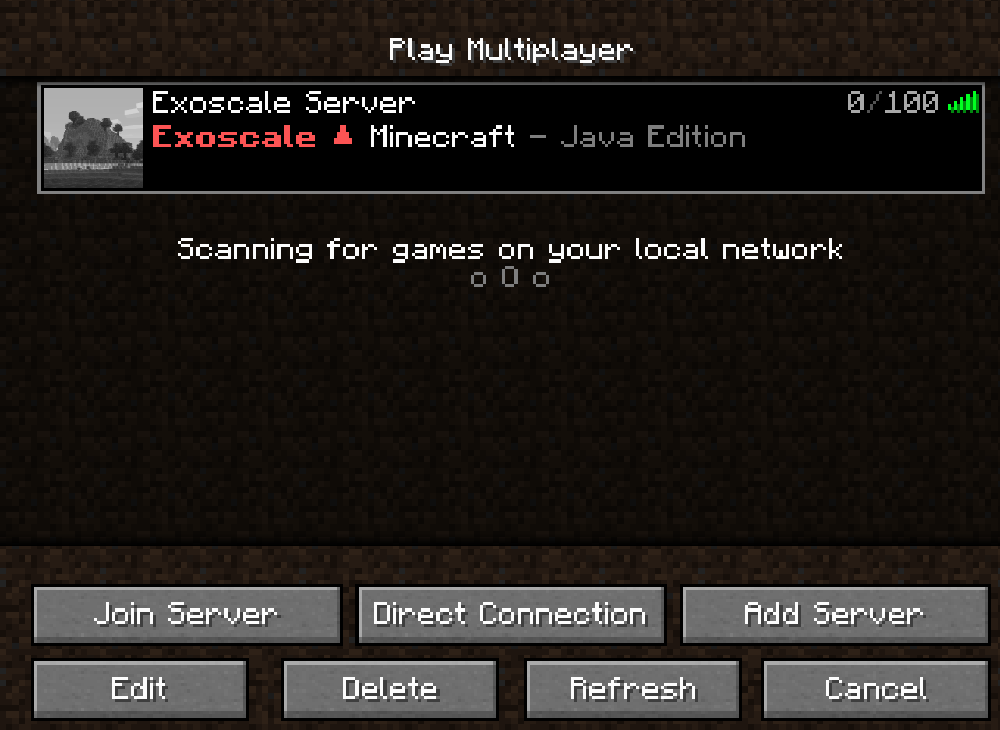

# Getting Started with Exoscale

## Access and Secret Key

Generate a new access and secret key (https://portal.exoscale.com/iam/api-keys)

*Note: for a better security (and to protect your budget!), we suggest you to create a RESTRICTED key to limit the rights of minectl.*


Get the generated API keys and keep this information in a safe place.


Open a terminal and Export the keys as ENV variables:

```
export EXOSCALE_API_KEY=EXO...
export EXOSCALE_API_SECRET=...
```

See https://community.exoscale.com/documentation/iam/quick-start/ for more details on Exoscale Credentials (Identity and Access Management, Exoscale IAM).

## Create SSH Keys

```
ssh-keygen -t rsa -f ./minecraft
```

## Create MinecraftServer config
Create a file named server-exoscale.yaml with the example below.
Have a look at https://minecraft.fandom.com/wiki/Server.properties/ to configure your server.

```bash
apiVersion: minectl.ediri.io/v1alpha1
kind: MinecraftServer
metadata:
  name: minecraft-server
spec:
  server:
    cloud: exoscale
    region: ch-gva-2
    size: medium
    ssh:
      port: 22
      keyfolder: "/xxx/path/to/your/private/key"
      fail2ban:
        bantime: 1000
        maxretry: 3
    port: 25565
  minecraft:
    java:
      openjdk: 17
      xmx: 2G
      xms: 2G
      rcon:
        password: test
        port: 25575
        enabled: true
        broadcast: true
    edition: java
    version: 1.18.1
    eula: true
    properties: |
      level-seed=stackitminecraftrocks
      view-distance=10
      enable-jmx-monitoring=false
      server-ip=
      resource-pack-prompt=
      # survival, creative, adventure, spectator
      gamemode=creative
      # allow users to travel to the Nether
      allow-nether=true
      enable-command-block=false
      sync-chunk-writes=true
      enable-query=false
      op-permission-level=4
      prevent-proxy-connections=false
      resource-pack=
      entity-broadcast-range-percentage=100
      level-name=world
      player-idle-timeout=0
      motd=\u00a7c\u00a7lExoscale \u25b2 \u00a7fMinecraft \u00a7r- Java Edition
      query.port=25565
      force-gamemode=false
      rate-limit=0
      hardcore=false
      white-list=false
      broadcast-console-to-ops=true
      pvp=true
      spawn-npcs=true
      spawn-animals=true
      snooper-enabled=true
      difficulty=easy
      function-permission-level=2
      network-compression-threshold=256
      text-filtering-config=
      require-resource-pack=false
      spawn-monsters=true
      max-tick-time=60000
      enforce-whitelist=false
      use-native-transport=true
      max-players=100
      resource-pack-sha1=
      spawn-protection=16
      online-mode=true
      enable-status=true
      #allow users to fly
      allow-flight=true
      max-world-size=29999984
```

## minectl 🗺
Once your configuration file is created, we will use it with minectl (see below).

In your Exoscale organizsation, Minectl will then:
- create a new instance called minecraft-server and deploy all necessary components
- add a security group (minecraft-server-sg) to allow the network traffic to your server
- import your public SSH key (minecraft-server-ssh).


```bash
minectl create --filename config/server-exoscale.yaml 

🛎 Using cloud provider  Exoscale
🗺 Minecraft  java edition
🏗 Creating server (minecraft-server)... ⢿ 
✅ Server (minecraft-server) created
🎬  Starting server...
✅ Server successfully started.

                   ID                  |       NAME       |  REGION  | TAGS |       IP
---------------------------------------+------------------+----------+------+-----------------
  4100ce1c-e3b0-4a63-b42d-ee76c75178e4 | minecraft-server | ch-gva-2 |      | 194.182.163.187

🪓 To delete the server type:

 minectl delete -f ./exoscale-server.yaml --id 4100ce1c-e3b0-4a63-b42d-ee76c75178e4


🆙 To update the server type:

 minectl update -f ./exoscale-server.yaml --id 4100ce1c-e3b0-4a63-b42d-ee76c75178e4


🔌 Connected to RCON type:

 minectl rcon -f ./exoscale-server.yaml --id 4100ce1c-e3b0-4a63-b42d-ee76c75178e4

🚧 Beta features:
⤴️ To upload a plugin type:

 minectl plugins -f ./exoscale-server.yaml --id 4100ce1c-e3b0-4a63-b42d-ee76c75178e4 --plugin <folder>/x.jar --destination /minecraft/plugins
```


## Minecraft Client

### Download

Download a Minecraft Client (Java Edition) under https://www.minecraft.net/en-us/get-minecraft

### Start your Minecraft Client


### Add your server


### Join the server



### Play the game


## minectl 🗺

Feed up with your server? Deleting is as easy as creating the server

```bash
minectl delete -f ./exoscale-server.yaml --id 4100ce1c-e3b0-4a63-b42d-ee76c75178e4

🛎 Using cloud provider Exoscale
🗺 Minecraft java edition
🗑 Delete instance (4100ce1c-e3b0-4a63-b42d-ee76c75178e4)... 
```

### Legal Disclaimer 👮

This project is not affiliated with Mojang Studios, XBox Game Studios, Double Eleven or the Minecraft brand.

- "Minecraft" is a trademark of Mojang Synergies AB.
- "Exoscale" is a trademark of Akenes SA, Switzerland.

Other trademarks referenced herein are property of their respective owners.