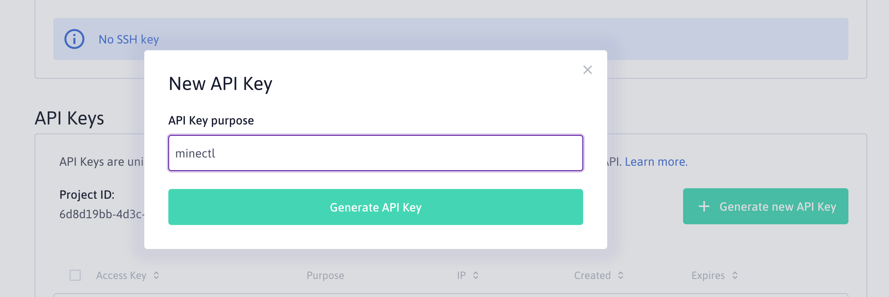
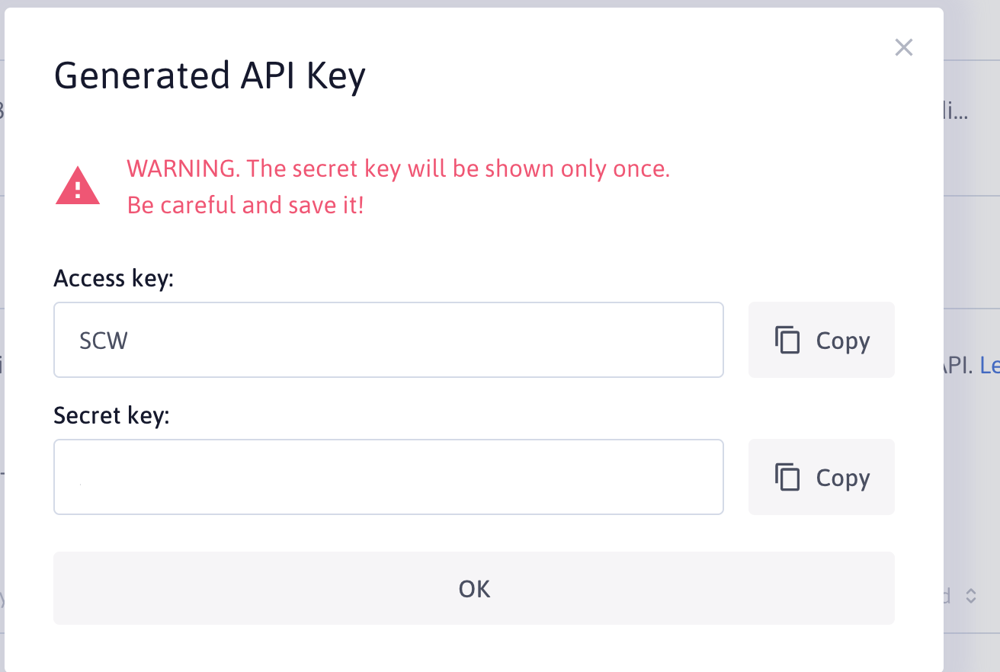
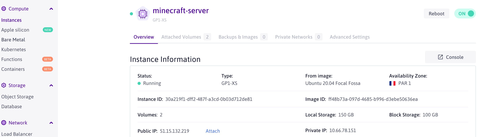
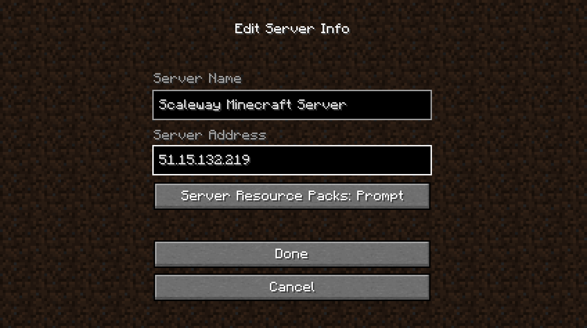
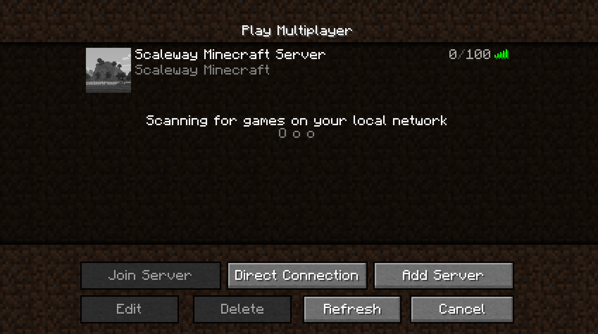
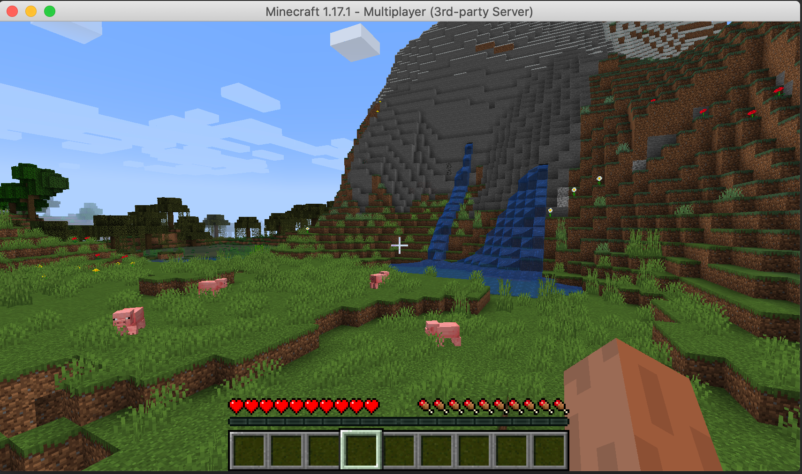

# Getting Started - Scaleway edition

## Access and Secret Key

Generate a new access and secret key (https://console.scaleway.com/project/credentials)



Get the generated API keys.



Export the keys as ENV variables:

```
export ACCESS_KEY=xxx
export SECRET_KEY=yyy
export ORGANISATION_ID=zzz
```

See https://www.scaleway.com/en/docs/generate-api-keys/ for even more details on Scaleway Credentials

## Create SSH Keys

```
ssh-keygen -t rsa -f ./minecraft
```

## Create MinecraftServer config

```bash
apiVersion: minectl.ediri.io/v1alpha1
kind: MinecraftServer
metadata:
  name: minecraft-server
spec:
  server:
    cloud: scaleway
    region: fr-par-1
    size: GP1-XS
    ssh: "xxx/ssh/minecraft.pub"
    port: 25565
  minecraft:
    java:
      openjdk: 16
      xmx: 2G
      xms: 2G
      rcon:
        password: test
        port: 25575
        enabled: true
        broadcast: true
    edition: java
    version: 1.17.1
    eula: true
    properties: |
      level-seed=minectlrocks
      view-distance=10
      enable-jmx-monitoring=false
      server-ip=
      resource-pack-prompt=
      gamemode=survival
      allow-nether=true
      enable-command-block=false
      sync-chunk-writes=true
      enable-query=false
      op-permission-level=4
      prevent-proxy-connections=false
      resource-pack=
      entity-broadcast-range-percentage=100
      level-name=world
      player-idle-timeout=0
      motd=Scaleway Minecraft
      query.port=25565
      force-gamemode=false
      rate-limit=0
      hardcore=false
      white-list=false
      broadcast-console-to-ops=true
      pvp=true
      spawn-npcs=true
      spawn-animals=true
      snooper-enabled=true
      difficulty=easy
      function-permission-level=2
      network-compression-threshold=256
      text-filtering-config=
      require-resource-pack=false
      spawn-monsters=true
      max-tick-time=60000
      enforce-whitelist=false
      use-native-transport=true
      max-players=100
      resource-pack-sha1=
      spawn-protection=16
      online-mode=true
      enable-status=true
      allow-flight=false
      max-world-size=29999984
```

## minectl 🗺

```bash
minectl create --filename config/server-scaleway.yaml 

🛎 Using cloud provider Scaleway
🗺 Minecraft java edition
🏗 Creating instance (minecraft-server)... ⢿ 
✅ Instance (minecraft-server) created
Minecraft Server IP: 51.15.132.219
Minecraft Server ID: 30a219f1-dff2-487f-a3cd-0b03d712de81

To delete the server type:

 minectl delete -f config/java/server-scaleway.yaml --id 30a219f1-dff2-487f-a3cd-0b03d712de81
```



## Minecraft Client

### Download

Download a Minecraft Client (Java Edition) under https://www.minecraft.net/en-us/get-minecraft

Start your Minecraft Client


Add your server



Join the server



Play the game



## minectl 🗺

Feed up with your server? Deleting is as easy as creating the server

```bash
minectl delete -f config/java/server-scaleway.yaml --id 30a219f1-dff2-487f-a3cd-0b03d712de81

🛎 Using cloud provider Scaleway
🗺 Minecraft java edition
🗑 Delete instance (30a219f1-dff2-487f-a3cd-0b03d712de81)... 
```

### Legal Disclaimer 👮

This project is not affiliated with Mojang Studios, XBox Game Studios, Double Eleven or the Minecraft brand.

"Minecraft" is a trademark of Mojang Synergies AB.

Other trademarks referenced herein are property of their respective owners.
