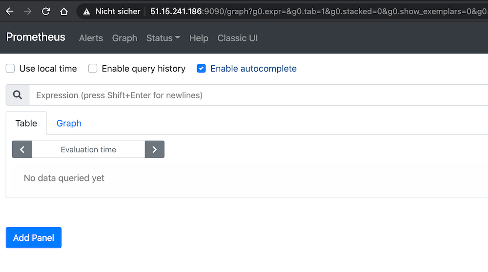
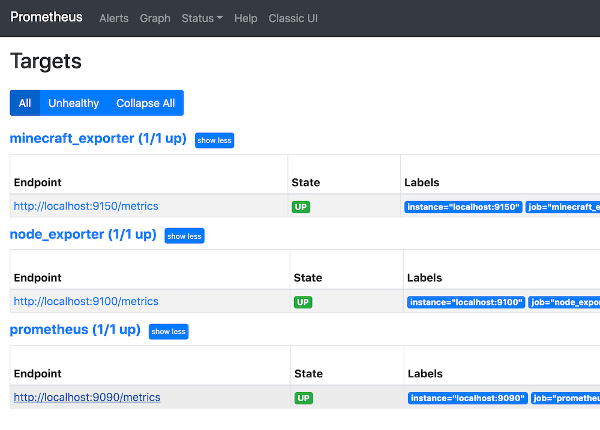
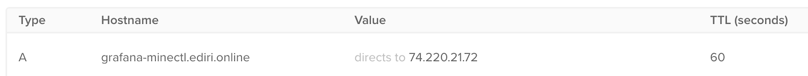
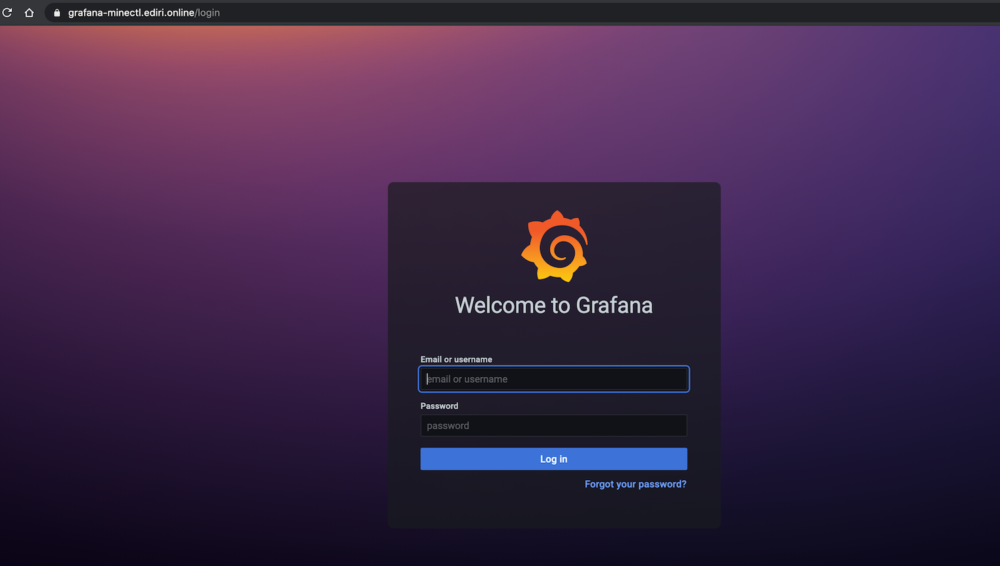
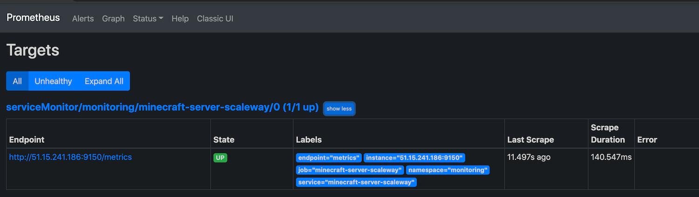
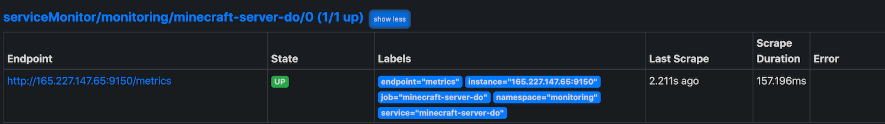
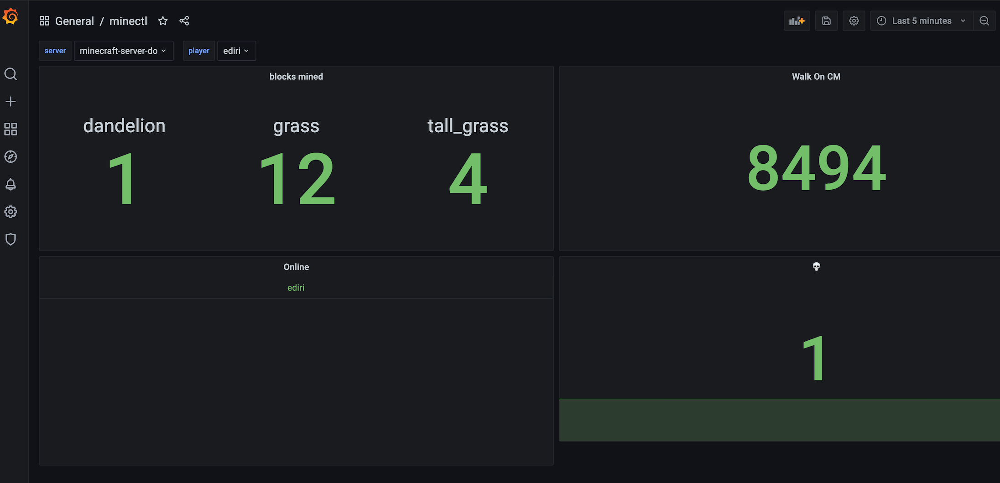

# How to monitor your multi-cloud minectl 🗺 server? - Civo edition

minectl 🗺 will be installed with following monitoring stack:

- Prometheus (https://github.com/prometheus/prometheus)
- Node exporter (https://github.com/prometheus/node_exporter)
- Minecraft exporter (https://github.com/dirien/minecraft-prometheus-exporter)

So you don't need to do anything. You can directly access your Prometheus instance via `http://<ip>:9090/graph` in the
browser of your choice.



Every target is already configured, and you are ready to go.



So how, we can use this setting to monitor multi-cloud minectl 🗺 server?

Enter the stage for `Civo`

# Civo, Kubernetes and the marketplace

Civo (https://www.civo.com), a UK-based startup, offers cloud native infrastructure services powered only by Kubernetes.
With launch times <
90s it is incredible fast and offers several state of the art ways of managing your clusters, using your favourite tools
like Terraform and Pulumi, or our simple to use CLI or API.

On top, Civo offers a curated marketplace of Kubernetes applications. With these we can quick and easy install them in
to our Civo Kubernetes clusters

# Create your Civo monitoring cluster

In these guide we will cover the CLI way to create a Civo monitoring cluster:

## CLI

Follow the instructions to install the [Civo CLI](https://github.com/civo/cli#set-up)

In order to use the command-line tool, you will need to authenticate yourself to the Civo API using a special key. You
can find an automatically-generated API key or regenerate a new key at https://www.civo.com/api.

So let us create a Civo Kubernetes Cluster and install the
[kube-prometheus-stack](https://github.com/prometheus-community/helm-charts/tree/main/charts/kube-prometheus-stack) as
the base for our monitoring stack.

We will install the cert-manager directly via the marketplace.

````bash
civo k3s create minectl-monitoring --nodes=1 --size=g3.k3s.large \
--applications=cert-manager,Nginx \
--remove-applications=Traefik
````

`The cluster minectl-monitoring (10142bd2-d34d-4804-941f-1e98e4a577da) has been created`

Wait until the cluster is ready to use.

```bash
civo k3s ls
+--------------------------------------+--------------------+--------+-------+-------+----------+
| ID                                   | Name               | Region | Nodes | Pools | Status   |
+--------------------------------------+--------------------+--------+-------+-------+----------+
| 10142bd2-d34d-4804-941f-1e98e4a577da | minectl-monitoring | LON1   |     0 |     0 | BUILDING |
+--------------------------------------+--------------------+--------+-------+-------+----------+
```

Get the kubeconfig or merge it your context. What ever you prefer.

```bash
civo k3s config minectl-monitoring --save -p civo.yaml
export KUBECONFIG=civo.yaml

kubectl get node

NAME                                             STATUS   ROLES    AGE   VERSION
k3s-minectl-monitoring-09b924fa-node-pool-2336   Ready    <none>   39s   v1.20.2+k3s1
```

The good part is, that we already installed the nginx ingress controller and the cert-manger. So we can directly dive
into the installation of
the [kube-prometheus-stack](https://github.com/prometheus-community/helm-charts/tree/main/charts/kube-prometheus-stack)

### Kubernetes

#### cert-manger

Prepare a DNS Alias (I use `grafana-minectl.ediri.online`) and point to the public IP of your ingress controller:



```bash
kubectl get svc -n ingress-nginx
NAME                                 TYPE           CLUSTER-IP     EXTERNAL-IP    PORT(S)                      AGE
ingress-nginx-controller-admission   ClusterIP      10.43.141.34   <none>         443/TCP                      30m
ingress-nginx-controller             LoadBalancer   10.43.58.0     74.220.21.72   80:30780/TCP,443:31620/TCP   30m
```

Let us now install the ns, certificate, and the (cluster)-issuer for our Grafana UI. As namespace, we use `monitoring`,
that will also the namespace we deploy the monitoring stack too.

```yaml
cat <<EOF | kubectl apply -f -
apiVersion: v1
kind: Namespace
metadata:
  name: monitoring
EOF
```

```yaml
cat <<EOF | kubectl apply -f -
apiVersion: cert-manager.io/v1
kind: Certificate
metadata:
  name: ediri-online
  namespace: monitoring
spec:
  secretName: ediri-online-tls
  issuerRef:
    name: letsencrypt-prod
    kind: ClusterIssuer
  dnsNames:
    - grafana-minectl.ediri.online
EOF
```

```yaml
cat <<EOF | kubectl apply -f -
apiVersion: cert-manager.io/v1
kind: ClusterIssuer
metadata:
  name: letsencrypt-prod
spec:
  acme:
    server: https://acme-v02.api.letsencrypt.org/directory
    email: info@ediri.de
    privateKeySecretRef:
      name: letsencrypt-prod
    solvers:
      - http01:
          ingress:
            class: nginx
EOF
```

Install the helm repo

```bash
helm repo add prometheus-community https://prometheus-community.github.io/helm-charts
helm repo update
```

Add our certificate and host to the grafana ingress:

```yaml
cat <<EOF > values.yaml
grafana:
  persistence:
    enabled: true
    size: 50Gi
    storageClassName: civo-volume


  serviceMonitor:
    enabled: true
    interval: 1m
    selfMonitor: false

  ingress:
    annotations:
      kubernetes.io/ingress.class: nginx
    enabled: true
    tls:
      - secretName: ediri-online-tls
        hosts:
          - grafana-minectl.ediri.online
    hosts:
      - grafana-minectl.ediri.online

  alertmanagerSpec:
    storage:
      volumeClaimTemplate:
        spec:
          storageClassName: civo-volume
          accessModes: [ "ReadWriteOnce" ]
          resources:
            requests:
              storage: 5Gi

prometheus:
  ingress:
    enabled: false

  prometheusSpec:
    replicas: 1

    storageSpec:
      volumeClaimTemplate:
        spec:
          storageClassName: civo-volume
          accessModes: [ "ReadWriteOnce" ]
          resources:
            requests:
              storage: 50Gi
EOF
```

```bash
helm upgrade -i monitoring prometheus-community/kube-prometheus-stack -n monitoring -f values.yaml
```

If everything works fine, you should be greeted with the Grafana screen. With a valid SSL certificate.



Login with the defaults `admin:prom-operator`

To get the minecraft metrics to appear in the prometheus, we need to use the Kubernetes service of type `ExternalName`
with `Endpoint` and the `ServiceMonitor`.

```yaml
cat <<EOF | kubectl apply -f -
apiVersion: v1
kind: Endpoints
metadata:
  name: minecraft-server-scaleway
  namespace: monitoring
  labels:
    app: minecraft-server-scaleway
    release: monitoring
subsets:
  - addresses:
      - ip: 51.15.241.186
    ports:
      - name: metrics
        port: 9150
        protocol: TCP
EOF
```

```yaml
cat <<EOF | kubectl apply -f -
apiVersion: v1
kind: Service
metadata:
  name: minecraft-server-scaleway
  namespace: monitoring
  labels:
    app: minecraft-server-scaleway
    release: monitoring
spec:
  type: ExternalName
  externalName: 51.15.241.186
  ports:
    - name: metrics
      port: 9150
      protocol: TCP
      targetPort: metrics
EOF
```

```yaml
cat <<EOF | kubectl apply -f -
apiVersion: monitoring.coreos.com/v1
kind: ServiceMonitor
metadata:
  name: minecraft-server-scaleway
  namespace: monitoring
  labels:
    release: monitoring
spec:
  jobLabel: monitoring
  selector:
    matchLabels:
      app: minecraft-server-scaleway
  namespaceSelector:
    matchNames:
      - monitoring
  endpoints:
    - port: metrics
      interval: 10s
EOF
```



Let us add a second minectl 🗺 server to the mix. This time we use DigitalOcean.

```bash
minectl create -f config/java/server-do.yaml      
🛎 Using cloud provider DigitalOcean
🗺 Minecraft java edition
🏗 Creating droplet (minecraft-server)... ⣟ 
✅ Droplet (minecraft-server) created
Minecraft Server IP: 165.227.147.65
Minecraft Server ID: 254489739
```

```yaml
cat <<EOF | kubectl apply -f -
apiVersion: v1
kind: Endpoints
metadata:
  name: minecraft-server-do
  namespace: monitoring
  labels:
    app: minecraft-server-do
    release: monitoring
subsets:
  - addresses:
      - ip: 165.227.147.65
    ports:
      - name: metrics
        port: 9150
        protocol: TCP
EOF
```

```yaml
cat <<EOF | kubectl apply -f -
apiVersion: v1
kind: Service
metadata:
  name: minecraft-server-do
  namespace: monitoring
  labels:
    app: minecraft-server-do
    release: monitoring
spec:
  type: ExternalName
  externalName: 165.227.147.65
  ports:
    - name: metrics
      port: 9150
      protocol: TCP
      targetPort: metrics
EOF
```

```yaml
cat <<EOF | kubectl apply -f -
apiVersion: monitoring.coreos.com/v1
kind: ServiceMonitor
metadata:
  name: minecraft-server-do
  namespace: monitoring
  labels:
    release: monitoring
spec:
  jobLabel: monitoring
  selector:
    matchLabels:
      app: minecraft-server-do
  namespaceSelector:
    matchNames:
      - monitoring
  endpoints:
    - port: metrics
      interval: 10s
EOF
```



Finally, we can start to use Grafana to create dashboard. The datasource is already configured for you.

Pro Tip: Working with Grafana variables, can help to select the specific minectl 🗺 server instance.



# Enjoy 🎊

Congratulations, you are done and can start build some fancy dashboards for your minectl 🗺 Minecraft server.

### Legal Disclaimer 👮

This project is not affiliated with Mojang Studios, XBox Game Studios, Double Eleven or the Minecraft brand.

"Minecraft" is a trademark of Mojang Synergies AB.

Other trademarks referenced herein are property of their respective owners.