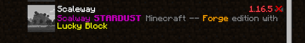
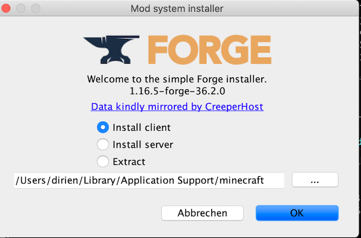
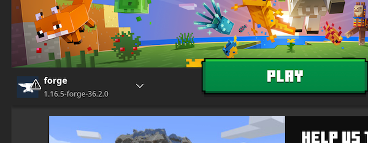
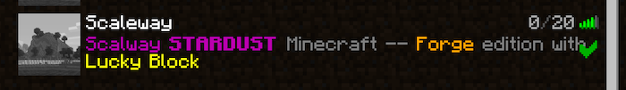
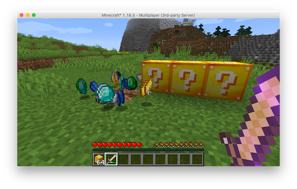

# Running a modded LuckyBlocks Minecraft Server on budget 💰 - Scaleway edition

In this tutorial, we want to run a Minecraft Forge Server with the [Lucky Block](https://www.luckyblockmod.com/) plugin
installed.

**The best part: Everything on a budget.**

## Lucky Block


I like Lucky Block, its fun to play and you never know what will happen, if you open a Lucky Block

> Originally created in 2015, the Lucky Block is a mod for Minecraft which has since gained over 5 million users. The mod adds a new block to the game which produces random outcomes, as well as items such as the lucky sword, bow and potion. Additionally, the mod can be customized with hundreds of community add-ons.

See https://github.com/alexsocha/luckyblock for details.

## RAM consumption and Minecraft.

A rule of thumb is. Every 1GB of RAM enables you around ~10-15 Slots for players to join.

Also, we need an eye on the amount of plugins, we are going to use. Mods and Plugins can really can have a bad impact on
your server performance.

So a rough table could look like this:

|RAM|Player|
|---|---|
|1GB|15|
|2GB|30|
|3GB|45|
|5GB|75|
|6GB|90|
|7GB|100|
|8GB|120|

## Scaleway instances

[Scaleway](https://www.scaleway.com/en/) is the rising star in the European Cloud provider market.

What I like on Scaleway, apart may other things, is that they are `Green` from the start.

> the most environmentally efficient and transparent cloud worldwide

Scaleway has this amazing [DEV1-S](https://www.scaleway.com/en/pricing/#development-instances) in their offering.

> 2 vCPU, 2 GB of RAM, 1 IPv4 address, 20B of local storage

For whopping €0.01/hour (~ $0,012/hour) you get enough power, for a small server. Perfect for a little play with friends.

## Assembly

### Server

> You need a valid SSH keypair. Generate it with following command:
>
> `ssh-keygen -t rsa -f scaleway-ssh`

Let us build the parts, so we can deploy our Lucky Block server

The `minectl` ServerManifest for Scaleway DEV1-S and Forge looks like this:

```yaml
apiVersion: minectl.ediri.io/v1alpha1
kind: MinecraftServer
metadata:
  name: minecraft-server
spec:
  server:
    cloud: scaleway
    region: fr-par-1
    size: DEV1-S
    ssh: "scaleway-ssh"
    port: 25565
  minecraft:
    java:
      openjdk: 8
      xmx: 1G
      xms: 1G
      rcon:
        password: stardust
        port: 25575
        enabled: true
        broadcast: true
    edition: forge
    version: 1.16.5-36.2.0
    eula: true
    properties: |
      motd=\u00A75Scalway \u00A7lSTARDUST \u00A7rMinecraft -- \u00A76Forge \u00A7redition with \u00A7eLucky Block
      level-seed=stackitminecraftrocks
      level-name=world
```

Save this to `scaleway.yaml`

Export the keys as ENV variables:

```
export ACCESS_KEY=xxx
export SECRET_KEY=yyy
export ORGANISATION_ID=zzz
```

Now we can launch our instance via `minectl`

```bash
minectl create -f stardust.yaml
```

Hold on, this can take a while. As `minectl` is compiling the Forge server from scratch.

Wait until you can see the server in your Minecraft Launcher:



Don't mind the version error. We come back later.

Add the Luck Block plugin. Go to the [Download](https://www.luckyblockmod.com/download?platform=forge) and download your
version of Lucky Block.

In above case, I am downloading the `1.16.5-1` version.

After this we can use `minectl` to upload the jar to the `/minecraft/mods` folder

```bash
minectl plugins -f scaleway.yaml --id d62a5331-a6e8-4a92-b1d2-c84800b822e0 --plugin luckyblock-1.16.5-1-forge.jar --destination /minecraft/mods
```

### Minecraft Client

Download the [Forge installer](https://files.minecraftforge.net/net/minecraftforge/forge/index_1.16.5.html), again we
use version `1.16.5 - 36.2.0`and run it:

```bash
java -jar forge-1.16.5-36.2.0-installer.jar
```

Select the `Install client` and point the Folder to location of your Minecraft client.



Copy the `luckyblock-1.16.5-1-forge.jar` you downloaded for the server to the `mods` folder in your client directory.

```bash
cp luckyblock-1.16.5-1-forge.jar /Users/dirien/Library/Application Support/minecraft/mods/luckyblock-1.16.5-1-forge.jar
```

Start your Minecraft client

You should have now following item selectable in the Launcher:



Select the `forge` item and press `Play`

Now the Server in the list is good to go.



To see some Lucky Block, I switched to creative mode and placed some blocks by hand. To do this I use a RCON client, to
give my user Admin rights.



🎊 That's it, have fun...

### Legal Disclaimer 👮

This project is not affiliated with Mojang Studios, XBox Game Studios, Double Eleven or the Minecraft brand.

"Minecraft" is a trademark of Mojang Synergies AB.

Other trademarks referenced herein are property of their respective owners.