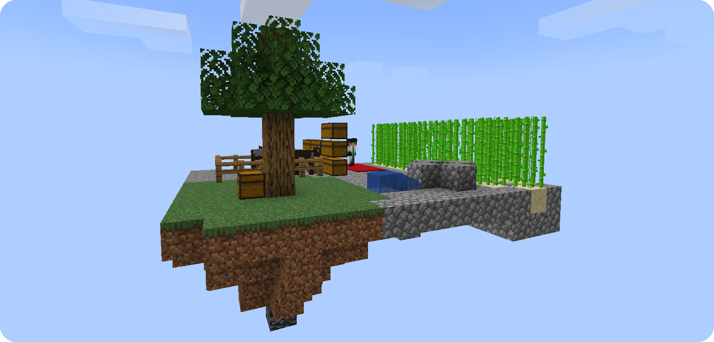
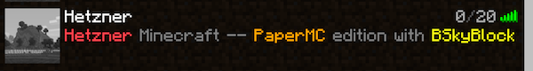
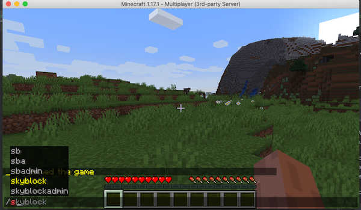
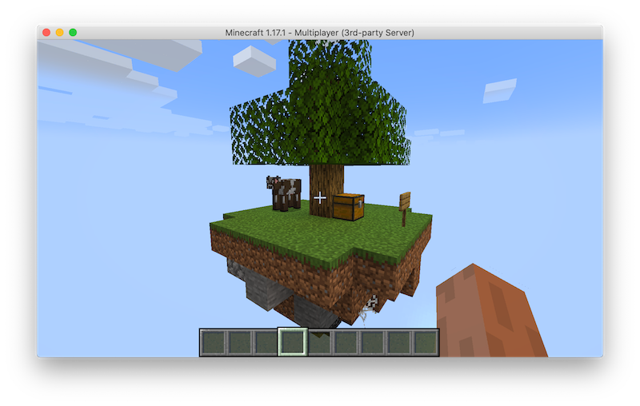

# Running a PaperMC SkyBlock server - Hetzner edition



SkyBlock is the most fun and addictive game mode, next to BedWars.

So why not use `minectl` to create a SkyBlock server.

For this tutorial, we are going to use PaperMC as server and the [BentoBox](https://github.com/BentoBoxWorld/BentoBox)
plugin.

## PaperMC

Paper (formerly known as PaperSpigot, distributed via the Paperclip patch utility) is a high performance fork* of
Spigot.

## BentoBox

BentoBox is a powerful Bukkit library plugin that provides core features for island-style games like SkyBlock,
AcidIsland, SkyGrid and others.

## Hetzner

From their website:

> As a leading webhosting provider and experienced datacenter operator in Germany, Hetzner Online offers professional hosting solutions for a fair price.

For this installation we going to choose their `CX21` plan which offers is 2vCPU, 4GB RAM and 40GB of disk.

That's all for `0,010€/h` or `5,83€/mo` which is quite a nice price.

## Assembly

### Server

> You need a valid SSH keypair. Generate it with following command:
>
> `ssh-keygen -t rsa -f hetzner-ssh`

Let us build the parts, so we can deploy our BentoBox SkyBlocks server

The `minectl` ServerManifest for Hetzner CX21 and PaperMC looks like this:

```yaml
apiVersion: ediri.io/minectl/v1alpha1
kind: MinecraftServer
metadata:
  name: minecraft-server
spec:
  server:
    cloud: hetzner
    region: nbg1
    size: cx21
    ssh: "hetzner-ssh"
    port: 25565
  minecraft:
    java:
      openjdk: 16
      xmx: 1G
      xms: 1G
      rcon:
        password: hetzner
        port: 25575
        enabled: true
        broadcast: true
    edition: papermc
    version: 1.17.1-138
    eula: true
    properties: |
      motd=\u00A7cHetzner \u00A7rMinecraft -- \u00A76PaperMC \u00A7redition with \u00A7eBSkyBlock
      level-seed=stackitminecraftrocks
      level-name=world
```

Save this to `hetzner.yaml`

Export the API token as ENV variables:

```
export HCLOUD_TOKEN=yyyy
```

Now we can launch our instance via `minectl`

```bash
minectl create -f hetzner.yaml
```

Wait until you can see the server in your Minecraft Launcher:



Now we can download the two plugins we need:

- BentoBox -> https://github.com/BentoBoxWorld/BentoBox/releases/tag/1.17.2
- BSkyBlock -> https://github.com/BentoBoxWorld/BSkyBlock/releases/tag/1.15.1

And upload them to our PaperMC server:

```bash
minectl plugins -f hetzner.yaml --id 13621910 --plugin plugins/BentoBox-1.17.2.jar --destination /minecraft/plugins
```

Wait that the server restarted and it's available in the launcher again, before uploading the second plugin.

According to the installation documents of BSkyBlock, it needs to be installed in the `addons` folder of the BentoBox.

So the upload command will look like this:

```bash
minectl plugins -f hetzner.yaml --id 13621910 --plugin plugins/BSkyBlock-1.15.1.jar --destination /minecraft/plugins/BentoBox/addons/
```

Wait again, for the server to be ready and join the server.

To enable BSkyBlock just type /skyblock in the ingame chat and choose an island



Done 🎊 



### Legal Disclaimer 👮

This project is not affiliated with Mojang Studios, XBox Game Studios, Double Eleven or the Minecraft brand.

"Minecraft" is a trademark of Mojang Synergies AB.

Other trademarks referenced herein are property of their respective owners.
